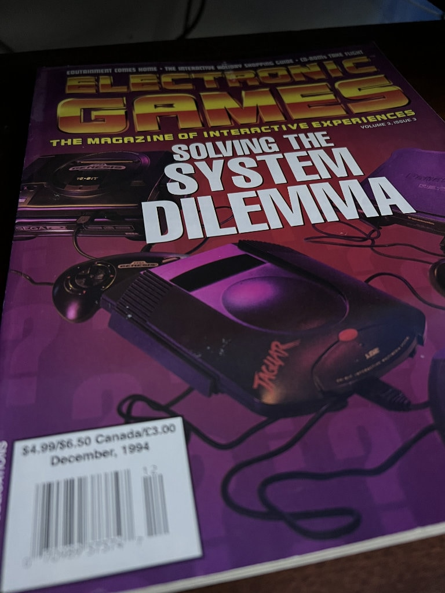
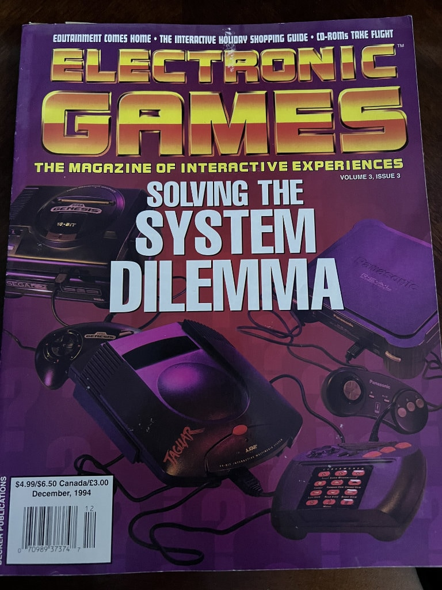
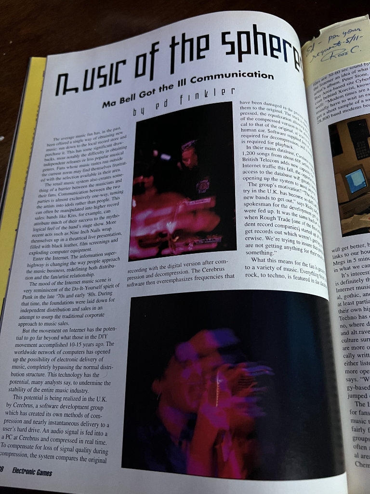
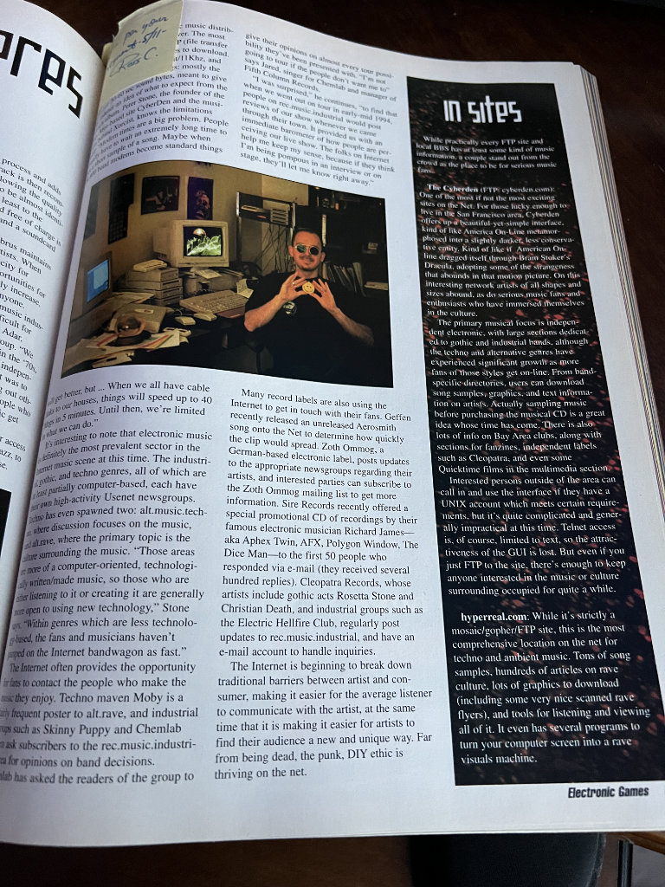
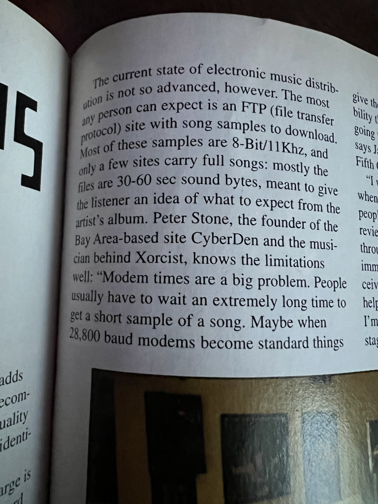
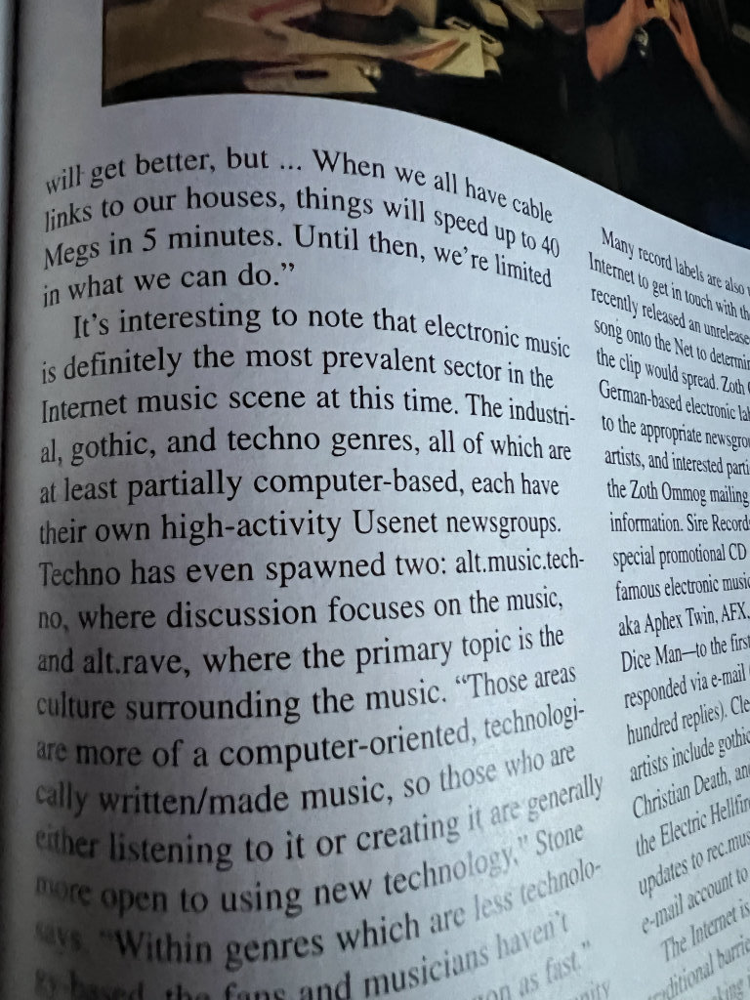
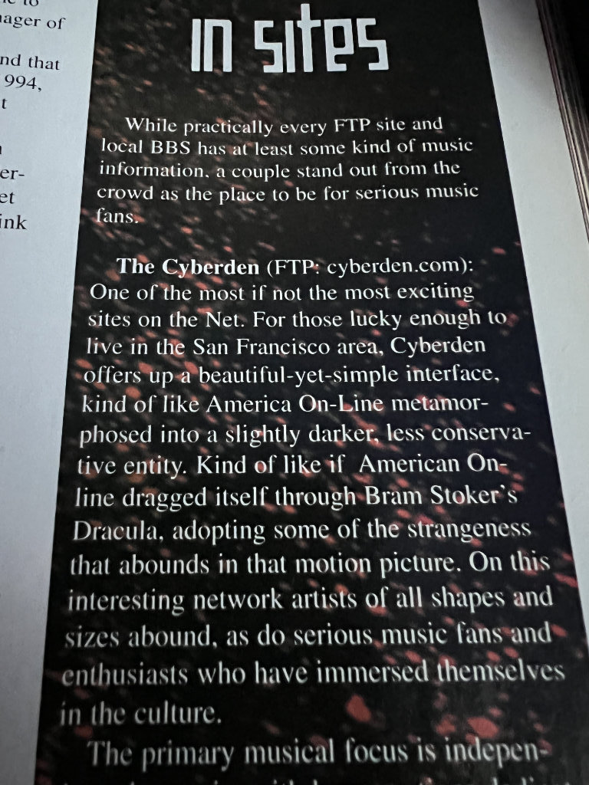
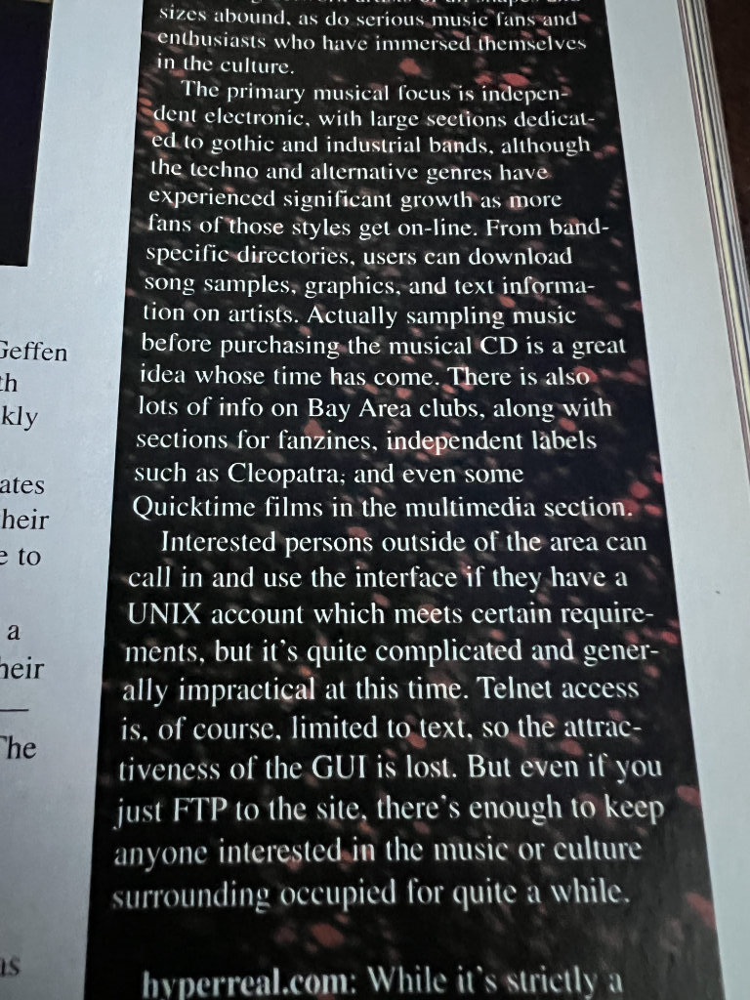
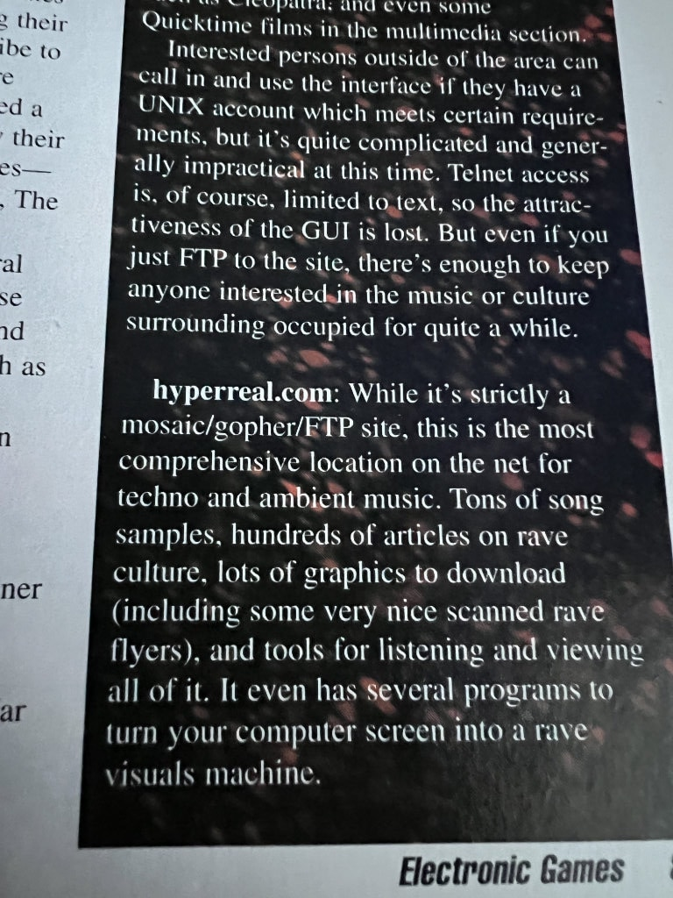

---
title: "DEAD AGENT: Chapters December 1994: How Arnie Katz Changed My Life"
lang: en-US
date: '2022-06-14T22:57:09-04:00'
ogType: article
ogImgUrl: https://deadagent.net/img/electronic-gaming-december-1994-music-of-the-spheres-article/thumb/IMG_5251.jpg
...

# Chapters: Dec 1994 - How Arnie Katz Changed My Life

    

        
    

    

        
    

    

        
    

    

        
    

    

        
    

    

        
    

    

        
    

    

        
    

    

        
    

My life has had many chapters. Some of them I am rediscovering. Yesterday I found one of them, the way I usually do: by moving old boxes.

This is your proof positive that I was a published writer in a real live magazine that was sold in real life bookstores and newsstands, when I was 19. Looking back now, I am pretty goddamn proud of that kid.

Sometimes it’s very important to remember how much you’ve already accomplished. This was a chapter of my life that was —temporarily — lost to me. Finding it reminds me that I am capable and strong, and have much to be proud of.

Also, if you are reading this somewhere: Arnie Katz, you were the one who opened the door to fanzines for me. I can trace everything I’ve done since then back to that:

- Music (esp. as a creative community)
- Writing
- Design and layout (Aldus PageMaker bb)
- Web design with HTML and CSS
- Generative art and image manipulation
- Programming
- Public speaking
- Organizing and creating a non-profit for mental health in tech

My art and my career. All that.

It really all started with that column in Video Games and Computer Entertainment, that you wrote, Arnie, about fanzines, and you encouraged people to make them about video gaming. And 13 year old me thought that sounded like a great idea. So I made one on my mom’s typewriter. Two double-sided pages.

I had that need to create and connect in me all the time. Arnie gave me the opportunity, and mentored and encouraged me. Imagine a 50 something dude talking to a 14 year old on the phone for an hour  while he peppers you with questions about the video game biz. But he tolerated it all, and kept encouraging me and supporting me.

Anyway, thank you Arnie. You are a true Mensch.

[Return](./)